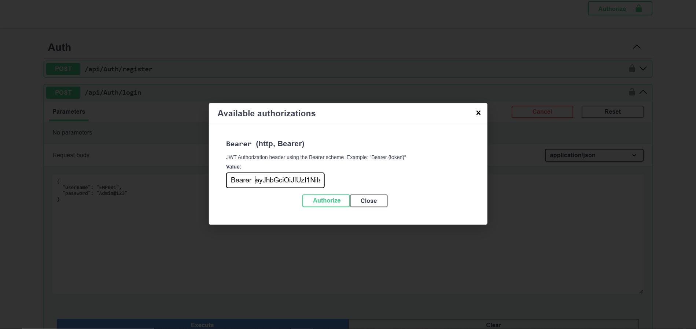
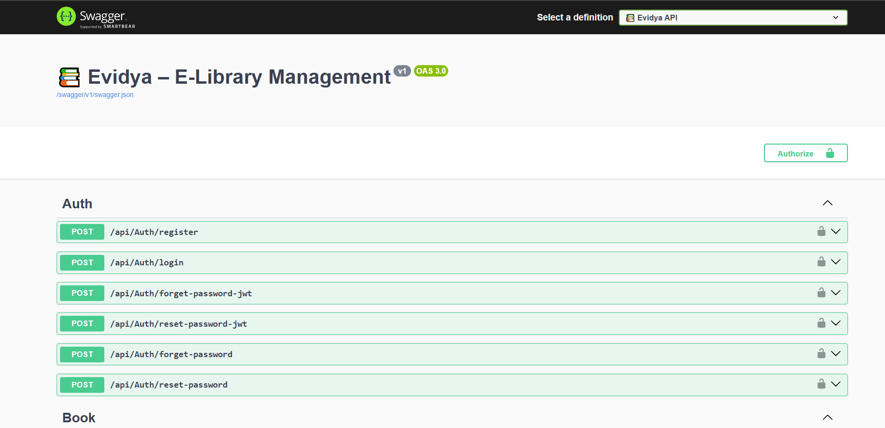
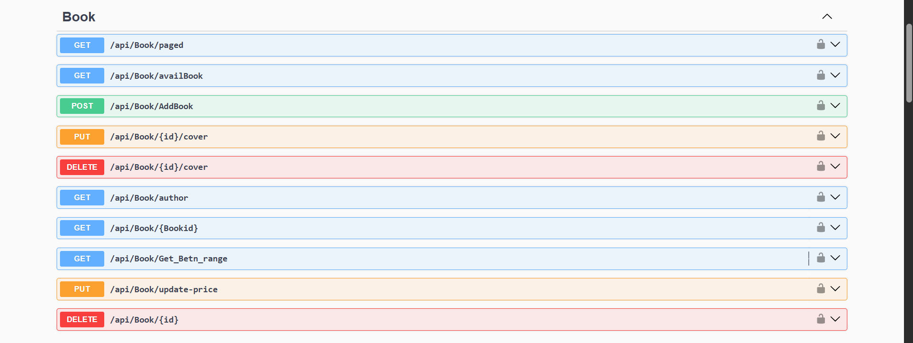
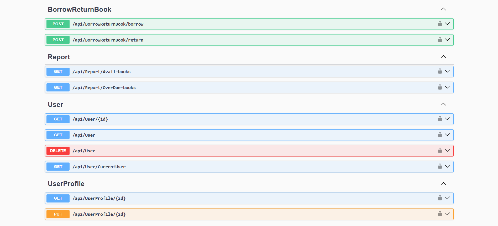

# 📚 Evidya – E-Library Management System

A **.NET Web API** for managing books and users in a digital library.
Users can **borrow and return books**, while admins can **manage books and view reports**.

The system automatically updates **book availability** and sends **email notifications** for borrow and return actions.

---
🌐 Live API

🚀 Live Swagger Documentation

👉 https://elibrary-vmhy.onrender.com/swagger/index.html

You can directly test the API endpoints from the deployed Swagger UI.
---

## 🚀 Features

* User registration and login with **JWT Authentication**
* **Role-Based Access Control (Admin / User)**
* Borrow and return book functionality
* Automatic book availability count update
* Email notifications for borrow and return actions
* Admin reports for **available and overdue books**
* Integrated **Swagger API documentation**

---

## 🛠 Tech Stack

* ASP.NET Core Web API
* C#
* Entity Framework Core
* SQL Server
* JWT Authentication
* Clean Architecture
* CQRS Pattern
* Docker
* Render Deployment

---
## ☁ Deployment

The API is deployed using cloud services and containerization:

- **Render** – Hosts the ASP.NET Core API
- **Railway** – Provides the MySQL database
- **Docker** – Used for containerizing the application
---

## 📷 API Documentation (Swagger)

### 🔐 Authentication APIs



### 📊 Swagger API Overview



### 📚 Book Management APIs



### 👤 User, Borrow & Report APIs



---

## ▶ Run the Project

Clone the repository:

```bash
git clone https://github.com/PratikByte/eLibrary.git
cd eLibrary
```

Run database migrations:

```bash
dotnet ef database update
```

Run the application:

```bash
dotnet run
```

Open Swagger UI:

```
http://localhost:5285/swagger/index.html
```

---

## 📂 Project Architecture

```
API
Application
Domain
Infrastructure
Shared
```

The project follows **Clean Architecture with CQRS**, ensuring better separation of concerns and maintainability.

---

## 👨‍💻 Author

**Pratik Zodpe**

---

⭐ If you like the project, consider giving it a **star**.
